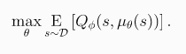
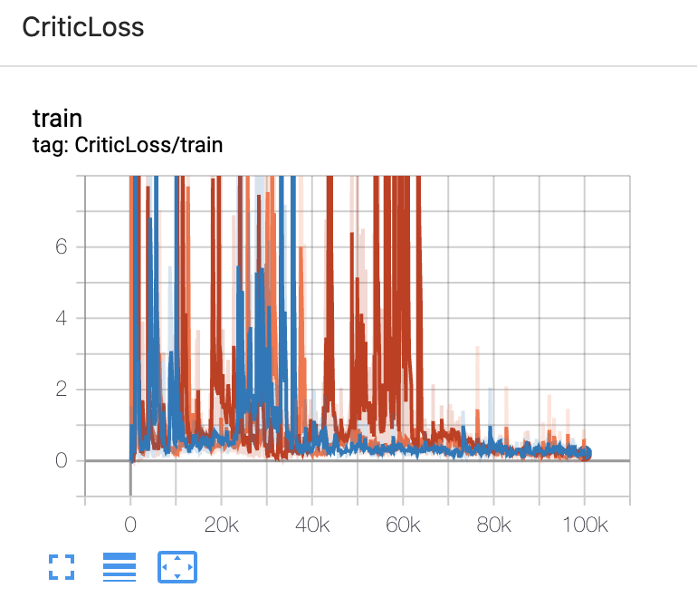
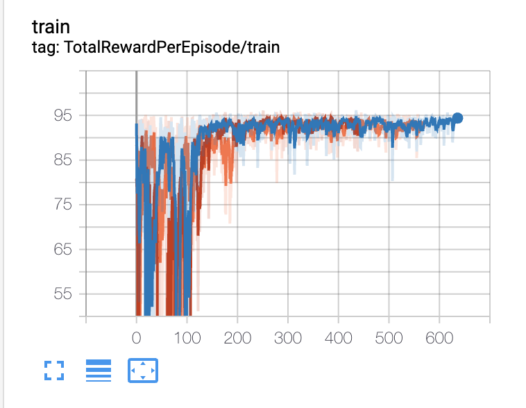

# Deep Deterministic Policy Gradient

## Descriptions
This is a Pytorch implementation of [**Deep Deterministic Policy Gradient**](https://arxiv.org/pdf/1509.02971.pdf).

DDPG is an actor-critic, model-free algorithm based on the deterministic policy gradient that can operate over continuous action spaces. It uses off-policy data and the Bellman equation to learn the Q-function, and uses the Q-function to learn the policy. The idea is to combine the actor-critic approach with insights from DQN. DQN is able to learn value functions in a stable and robust way due to two reasons: 1. off-policy data from replay buffer to minimize correlation between samples 2. existence of target Q network to give consistent targets durign TD backups. The policy learning part is fairly simple because the action space is continuous, and so we can just perform gradient ascent to solve 

. 
For this implementation, time-correlated OU-noise, suggested by the original paper, is used to encourage exploration.

## Create the environment
* Create a virtual environment with python 3+

On macOS and Linux:
```bath
python3 -m venv env
```
On Windows:
```bath
py -m venv env
```
* activate the virtual environment by
```bath
source env/bin/activate
```
* run
```bath
pip install -r requirements.txt
```

## To train
```bath
python ddpg.py
```
The result can be visualized on tensorboard using
```bath
tensorboard --logdir=runs
```
This also saves model paramaters inside model/ directory
## To test
```bath
python ddpg.py --mode=test
```
The result can be visualized on tensorboard using
```bath
tensorboard --logdir=runs
```

## Training details

### MountainCarContinuous-v0

The following result shows loss curves on three different seeds.

* Policy loss


* Critic loss



* Reward per episode



## Evaluation


## Solved requirements
According to [**here**](https://github.com/openai/gym/wiki/MountainCarContinuous-v0), getting a reward over 90 solves the MountainCar environment