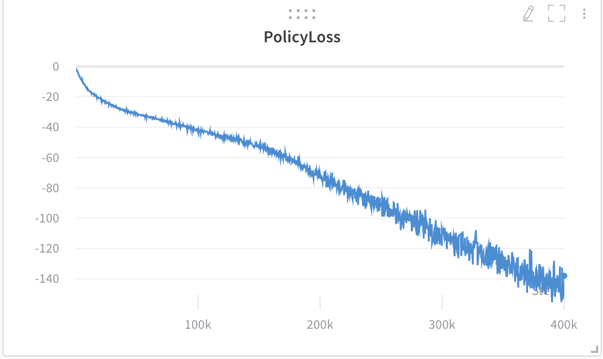
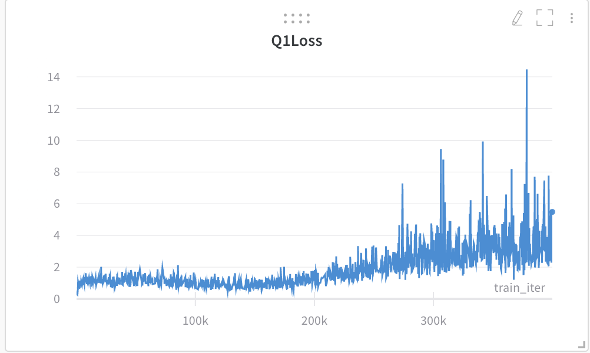

# Soft Actor-Critic

## Descriptions
This is a pytorch implementation of [**Soft Actor-Critic**](https://arxiv.org/pdf/1801.01290.pdf).

SAC is an off-policy actor-critic deep RL algorithm based on the maximum entropy reinforcement learning framework. The actor has to maximize the trade-off between expected reward and entropy, a measure of randomness in the policy. By including entropy regoularization, the model learns to succeed at the task and also learns to act randomly. Similar to TD3(Twin Delayed DDPG), SAC learns two Q-functions. Those two Q-functions regress to a single shared target, which is computed using target Q-networks. Target Q-networks are obtained by polyak averaging the Q-networks parameters over the course of training. The Q-value used for policy optimization is the smaller of the two Q approximators. For this implementation, fixed entropy reguluarization entropy coefficient is used. There is also a variant of SAC that varies the coefficient over the course of training. 

The algorithm goes as follows:

. 


## Create the environment (NOTE TO SELF: still need requirements.txt)
* Create a virtual environment with python 3+

On macOS and Linux:
```bath
python3 -m venv env
```
On Windows:
```bath
py -m venv env
```
* activate the virtual environment by
```bath
source env/bin/activate
```
* run
```bath
pip install -r requirements.txt
```

## To train (NOTE TO SELF: wandb is used now, change to tensorboard!)
```bath
python ddpg.py
```
The result can be visualized on tensorboard using
```bath
tensorboard --logdir=runs
```
This also saves model paramaters inside model/ directory
## To test
```bath
python ddpg.py --mode=test
```
The result can be visualized on tensorboard using
```bath
tensorboard --logdir=runs
```

## Training details

### HalfCheetah-v2

* Policy loss



* Q1 Loss


* Q2 Loss



* Reward per episode


## Evaluation

* Reward per episode


* Visualization should look similar to the following

[](https://www.youtube.com/watch?v=9jJEE4BMwLM)


